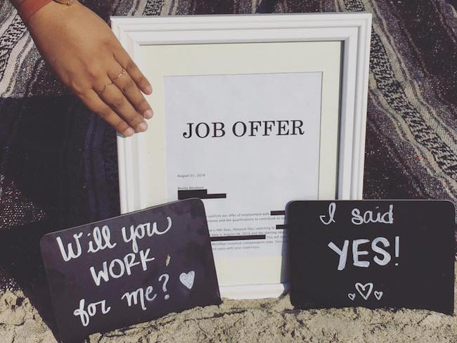
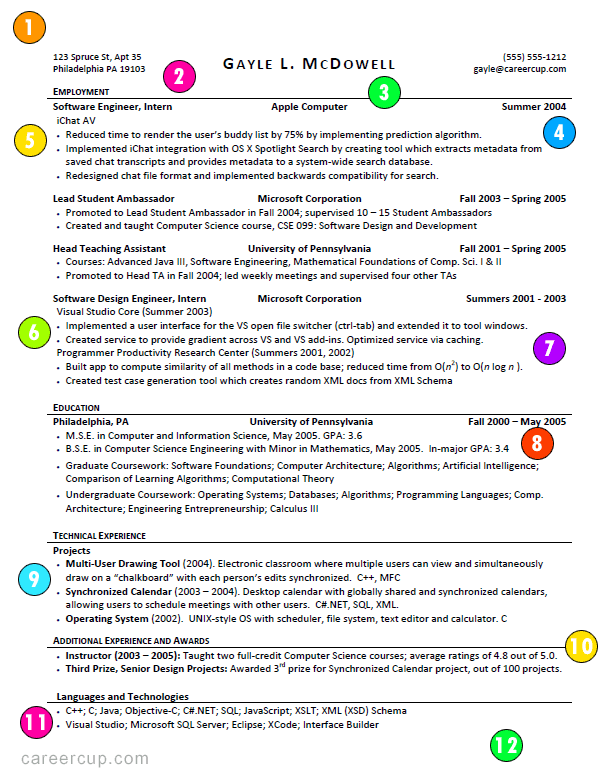
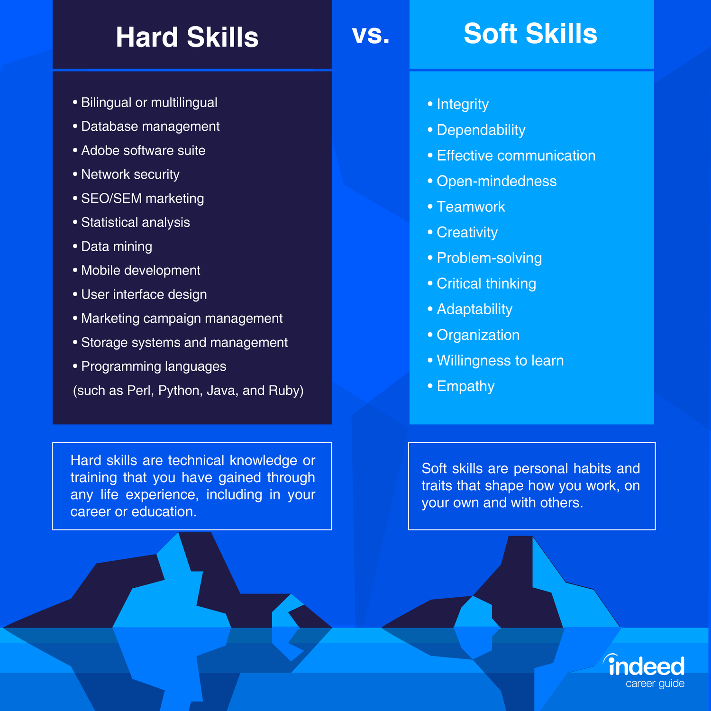
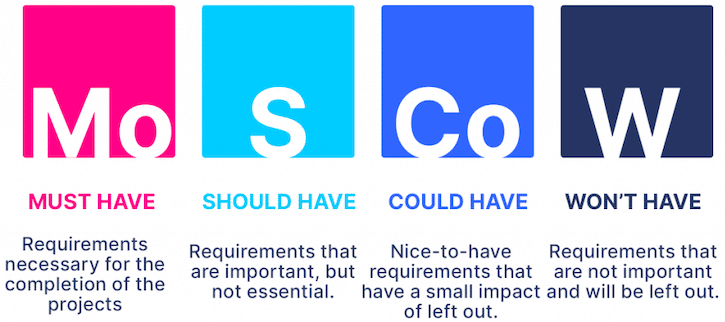

# How to get a Job/Relocation offer!?
Here I share some tips about CV/Resume and Interviews to get a job offer easily. Simply you just need a contract with a company to get the work permit & visa, but how? follow the below steps:

## Contribution ♡
If you found my repo helpful please give it a star 👍, and don't just clone it 🤗, as it motivates me to update such kinds of info and help the community, for any comments (please share that on [Discussions](https://github.com/coditori/highly-skilled-job-offers/discussions) section) or some improvements please feel free to send a pull request. It would be perfect to translate this repo into multiple languages ^_^

## Table of content (click to open):
0. [How to choose a country for living in?](#0--how-to-choose-a-country-for-living-in)
1. [CV/Resume](#1--cvresume)
2. [How to find or apply for a job?](#2--how-to-find-or-apply-for-a-relocation-job)
3. [Be aware of different time zones](#3--schedule-the-interview)
4. [Skills](#4--skills)
5. [Things to Remember before an Interview](#5--things-to-remember-before-an-interview)
6. [Mock Interview](#6--mock-interview)
7. [The Interview](#7--the-interview-itself)
8. [After the Interview](#8--after-the-interview)
9. [Interview Improvement process](#9--interview-improvement-process)

## The benefits of getting a job offer
- No language certificate is needed (IELTS/TOEFL), but at least need to have an intermediate or upper intermediate English level.
- Usually, no need to be educated
- The company offers a relocation package (flight tickets, one month's rent, ...)
- The company helps you to get a visa faster

## 0- How to choose a country for living in?
Consider these items (which you can find more on google :))
#### General items
- [Passport Index](https://www.passportindex.org/byRank.php) - Higher is better
- [Happiness Index](https://worldpopulationreview.com/country-rankings/happiest-countries-in-the-world) - Higher is better
- [English Proficiency Index](https://worldpopulationreview.com/country-rankings/english-proficiency-by-country) - Higher is better
- [GDP Per Capita Index](https://worldpopulationreview.com/country-rankings/gdp-per-capita-by-country) - Higher is better
- [Economy Index](https://www.heritage.org/index/ranking) - Higher is better
- [Racial Discrimination Index](https://www.indexmundi.com/surveys/results/8) - Lower is better
- [Living Cost](https://www.numbeo.com)
- The laws and cultural fit
- Tax
#### Job-related items
- Job market  (number of opening job applications)
- Average Salary
- Job Satisfaction

Find this [Glassdoor's top jobs](https://www.glassdoor.com/List/Best-Jobs-in-America-LST_KQ0,20.htm) based on the above metrics.
## 1- CV/Resume:
#### 1-1 Make a standard ATS-compatible CV
What is ATS compatible? An applicant tracking system (ATS) is a software application that reads your CV/Resume and gives human resources some results. In many cases, they filter applications automatically based on given criteria such as keywords, skills, former employers, years of experience and schools attended. This has caused many to adopt resume optimization techniques similar to those used in search engine optimization when creating and formatting their résumé.

#### 1-2 What Does a Good Resume Look Like?
A good Resume Should have a good structure here you can find some real samples:

##### CV templates
- [Microsoft Work template](https://www.careercup.com/resume)
- [Latex format](https://github.com/posquit0/Awesome-CV) (I prefer latex)

##### CV builders
- [indeed.com](https://www.indeed.com/create-resume)
- [resume.com](https://www.resume.com/resume/builder/)
- [resumehelp.com](https://www.resumehelp.com/builder/how-it-works)
- [cvmkr.com](https://cvmkr.com/CV/new#0)
- [resumegenius.com](https://resumegenius.com/)

#### 1-3 How to optimize my CV?
Remember recruiters will only check the CV for less than a minute so it should follow lots of factors. These tools can improve the CV:
- [Resumeworded](https://resumeworded.com) (It's free)

#### 1-4 Don't use a general CV for all Job Applications!
Try to match your skills with the job's required skills, to do so you can use a [Job Match tool](https://www.jobscan.co/) to see how many similar skills are mentioned in your resume.

#### 1-5 I'm not a native English speaker
- Try to use free grammar checker like [Grammarly](https://www.grammarly.com)
- Take a look at other successful people's CV (check their Linkedin of asking them to share their CVs)
- Ask an expert to write a CV for you
- Ask a human resource expert or a friend who got the job offer to review your CV

#### 1-6 General suggestions (I applied for many applications and could not get any interviews!)
- Try to use a simple 1 column CV template
- If you have less than 10 years of experience your CV should be a 1-page long document
- Have two cv/resume versions (short and long), and send the short to ATS systems
- If experience + education parts can fill the whole page then remove below sections (based on priority): 
  1. A summary is not needed
  2. Skills section is not needed (instead put skills after each bullet point or at the end of each company experience)
  3. Languages
- Be specific! do not explain a lot! 1-2 lines (s) for each bullet point is enough. Focus on the main thing you did and remember senior people will check your CV very fast.
- Don't put links with empty content like Github with no activity at all!

## 2- How to find or apply for a relocation job?
#### 2-1 Through Recruiters
Make some connections (in Linkedin or other platforms) with recruiters in the country you wanna move to. You can also do these:
- Change your Linkedin location to the country you wanna move
- Enable open-to-work and select positions and countries
- Whenever they message you send them a snippet that shows you need visa sponsorship or not and your years of experience, and how they can talk with you.
- Connect with these people on Linkedin "Recruiters/Human Resource Experts/Talent Acquisitions"
- Ask recruiters where is their base location, if they are living in another location where you wanna move they will waste your time (They only connect to you to put your data in their database, they usually have no client. Be aware!)

You also check [How to Use LinkedIn to Get a Job](https://www.topresume.com/career-advice/14-ways-to-leverage-your-linkedin-profile-during-your-job-search) or [How to Use LinkedIn When You Are Looking For a Job](https://www.linkedin.com/pulse/how-use-linkedin-when-you-looking-job-part-1-your-profile-piedmont/)
#### 2-2 Apply online on job platforms
You can find Job Applications through Linkedin or other platforms or just go to the company career page and apply there.
<table>
<thead>
<tr>
<th>Platform</th>
<th align="center">Supported countries</th>
<th align="center">Visa & Sponsorship option</th>
</tr>
</thead>
<tbody>
<tr>
<td><a href="https://www.iamexpat.nl/career/jobs-netherlands">iamexpat.nl</a></td>
<td align="center">Netherlands</td>
<td align="center"><ul><li>- [x] </li></ul></td>
</tr>
<tr>
<td><a href="https://relocate.me/">relocate.me</a></td>
<td align="center">Multiple countries</td>
<td align="center"><ul><li>- [x] </li></ul></td>
</tr>
<tr>
<td><a href="https://www.linkedin.com/">Linkedin</a></td>
<td align="center">Multiple countries</td>
<td align="center"><ul><li>- [ ] </li></ul></td>
</tr>
</tbody>
</table>

#### 2-3 Companies that provide Visa Sponsorships (Apply by the company website)
You can also check this repository: [List of companies offer Visa Sponsorships](https://github.com/shubheksha/companies-sponsoring-visas)

#### 2-4 How to find companies that can sponsor a visa?
In some countries, there is a list of all companies which have the license to sponsor ex-pat workers to meet their business goals.

- [Netherlands](https://ind.nl/en/public-register-recognised-sponsors)
- [UK](https://www.gov.uk/government/publications/register-of-licensed-sponsors-workers)
- [Sweden](https://assets.publishing.service.gov.uk/government/uploads/system/uploads/attachment_data/file/903888/2020-07-27_Tier_2_5_Register_of_Sponsors.pdf)
- Germany: Not found 404 :|
- [Denmark](https://nyidanmark.dk/en-GB/Words%20and%20Concepts%20Front%20Page/SIRI/List%20certified%20companies)

#### 2-5 Remote jobs
First, you need to know you can not work remotely from some countries and a lot of companies prefer to work with freelancers who have an official bank account in their country or have a registered company under your name. To find these jobs you can find this repo helpful [remote jobs](https://github.com/remoteintech/remote-jobs).

## 3- Schedule the interview
It's a common mistake that you have an interview in another time zone and you miss the interview because of miscalculations. With [Calendly](https://calendly.com) you can easily set up your calendar and ask people to find a free slot in your calendar.

## 4- Skills

Let's go into a little bit more detail.

#### 4-1 Soft skill
Personal attributes that enable someone to interact effectively and harmoniously with other people. It's not a good idea to put soft skills directly on a CV (like "team player"), but it'd be good to mention them under the hood in the CV bullet points. Following you can find some youtube content that can help you in this particular area. This is also the list of soft-skill questions they will ask you through the interview: 

##### Improve Soft skills
- [08 common Interview questions and answers - Job Interview Skills](https://www.youtube.com/watch?v=1mHjMNZZvFo)
- [Tell Me About Yourself - A Good Answer to This Interview Question](https://www.youtube.com/watch?v=kayOhGRcNt4)
- [Self-introduction in interview || How to introduce yourself in an interview](https://www.youtube.com/watch?v=r29CFLctWIY)
- [Interview Question: Tell Me About Yourself | Best Answer for Freshers & Experienced People](https://www.youtube.com/watch?v=EzGH3hZuJVk)
#### 4-2 Hard skills
Hard skills are objective, quantifiable skills gained through training, school, or work experiences. Hard skills are often usually something that can be taught or learned. If you are a Software Engineer and you write code in Java, then Java is one of your hard skills. Examples of software engineer hard skills:
- Software development
- Object-oriented design (OOD)
- Software testing, debugging
- Computer programming and coding
##### 4-2-1 Improve Hard Skills (For programmers)
- [Exponent channel (on youtube)](https://www.youtube.com/c/ExponentTV/videos)
- [Coding Interview Preparation on youtube](https://www.youtube.com/results?search_query=coding+interview+preparation)
- Solve problems on Leetcode, Codewars, Hackerrank
## 5- Things to Remember before an Interview
1. Dressing the Part
2. Review the Questions The Interviewers Will Ask You
3. Do Enough Research on the Company
4. Be Respectful of the Interviewers
5. Good Non-Verbal Behavior
6. Be On Time for the Interview
7. Know all the Credentials of the Company and the Job you're Applying For
8. Bring Extra Resumes (If it's an on-site interview)
9. Speak with Energy and Provide True Details
10. Writing Thank You Letters Immediately After the Interview

You can find the full list with details in [uiowa](https://careers.uiowa.edu/careerbuzz/201509/10-things-do-right-interview)

## 6- Mock Interview
Find a colleague or friend and have a mock interview with her/him
#### 6-0 Mock Interview websites
<table>
<thead>
<tr>
<th>Platform</th>
<th align="center">Free</th>
</tr>
</thead>
<tbody>
<tr>
<td><a href="https://www.pramp.com/">Pramp</a></td>
<td align="center"><ul><li>- [x] </li></ul></td>
</tr>
<tr>
<td><a href="https://interviewbuddy.in/">Interview Buddy</a></td>
<td align="center"><ul><li>- [ ] </li></ul></td>
</tr>
<tr>
<td><a href="http://www.gainlo.co">Gainlo</a></td>
<td align="center"><ul><li>- [ ] </li></ul></td>
</tr>
<tr>
<td><a href="https://www.interviewbit.com/">Interview Bit</a></td>
<td align="center"><ul><li>- [X] </li></ul></td>
</tr>
<tr>
<td><a href="https://interviewing.io/">Interviewing</a></td>
<td align="center"><ul><li>- [X] </li></ul></td>
</tr>
<tr>
<td><a href="https://www.techmockinterview.com/">Tech Mock Interview</a></td>
<td align="center"><ul><li>- [ ] </li></ul></td>
</tr>
<tr>
<td><a href="https://myinterviewpractice.com">My Interview Practice</a></td>
<td align="center"><ul><li>- [X] </li></ul></td>
</tr>
</tbody>
</table>

## 7- The Interview itself
Companies have different structures some will start with a personal human resource interview and some will drop you an online assignment first, but there are usually three main parts:

#### 7-0 General tips
- Try to not speak fast (not so slowly also, but you should record your voice and listen to that)
- Use simple verbs and explain technical things as simple as possible
- Listen carefully and if you did not get the question ask them to explain it
- [How to Appropriately Use Humor in Interviews?](https://www.topresume.com/career-advice/how-to-appropriately-use-humor-in-an-interview) Say a funny reason thing in the Interview, but not too far! not a joke. Eg: I moved to the Netherlands because rain is fancy in my country :)

#### 7-1 Introduction call
Try to have a structure when you introduce yourself (introduction can be around 5 mins), I will suggest this structure but you are free to use it or not (this is based on my experience):
- About yourself: Companies can see your professional life on your CV and here you can give a good overview of yourself! Start with your name/age and where are you living right now, why you moved to their country if you relocated before (why you like it), and your hobbies (2 mins)
- The first and last companies: Eg: I started my first job at ... now working at ... for N number of years, Try to mention company size, Industry, B2B or B2C (30 seconds)
- The team: Team size, Teamwork methodologies (Scrum, Kanban, ...), how you interact with POs (Project Owner), PMs (Product Manager) (30 seconds)
- The latest project and technologies: Most important part of the interview is to try to mention your latest challenge (don't need to mention here how you solved the issue because it's probably a long story, so just mention the challenge later on they will ask about this challenge in details and you can give them more information) Eg: We are building a payment application with Java11 and we had a challenge to manage state over Microservices we also used  Spring boot, Automated CI/CD, Oauth, Microservices, and Kafka, ... (1 min)
#### 7-2 Technical interview
Prepare a brief introduction about you, years of experience, and your latest project challenge (30 seconds), and tell them you are learning a specific technology in your free time (that shows you want to be updated even in your free time) also remember these when they ask a question:
- Don't jump into solving problem
- Be specific and give them a short answer (just mention important things)
- Try to understand what the question is
- Make sure you say "I don't know" when you did not know a specific technology or you don't know how to solve a challenge, but ask them if they would like to hear your naive solutions/ideas
- Go ahead and ask about the functional part of the system (or the interviewer may ask this): How the system works, Eg: If you want to design the Tiktok then ask about Uploading Size, Video caption, Feed videos (followers + recommender engine), favourite videos, following users
- Non-functional part of the system: Scale (how many users?), Performance (transactions per second), API, Latency, Availability
- Technical questions: Why SQL? How you managed the state? troubleshooting, ...
- Have a conversation between you and the interviewer (like when you do it with a team
##### 7-2-1 Technical Assignment
Use the MoSCOW model and give them simple software that can work rather than something complex and buggy!

- Before coding estimate your coding time
- Only focus on the "Must Have" section not other parts
- Recheck with the company that you understand what is the requirement

In coding follow these steps:
1. Try to understand the business logic and problem
2. Tests are mandatory (start with TDD and do not postpone it)
3. Clean code
4. Documentation
5. Consider Edge cases (API can return 500 status codes? is it allowed to have 500?)
6. Design patterns or separation of concepts are important
7. Your REST API is standard? inputs are validated?
8. Exception handling & fault recovery
9. Logging
10. If could deliver the task at the right time then talk about non-functional in the documentation part and give them suggestions like scale-out, cache, ...
##### 7-2-2 Technical Interview (without coding)
What they usually ask in technical interviews (Software engineers sample) depends on your experience, job requirements and your introduction:
1. Programming Language (E.g: new features in the latest version of Java)
2. Data Structures and their complexities (which one has a faster lookup? LinkedinList or ArrayList?)
3. Your framework (E.g: how Spring Boot handles injection?)
3. Microservices and their challenges (how you handle transactions in Microservices)
4. Restful API (difference between the POST and GET HTTP methods)
5. Security, oAuth, JWT, OWASP (super crucial for Banks, )
6. TDD & Clean Code
7. Deployment, AWS, Docker, 12-factor apps, ...
7. Troubleshooting & Monitoring
8. Profiling and stress tests
9. Documentation

##### 7-2-2 Online Pair Programming

#### 7-3 Final talk over contract and bonuses (relocation package and ...)
- How much you should pay as normal rent (the most important issue after getting a visa is finding a house and how they can help you in this process)
- Ask them about the relocation package
- Contract starting day (Can you start remotely!?)
- Visa process
- Company car
- How many days a week do you need to go to the office?
- Number of salaries in a year (12 or 13), Tax, holiday allowance
## 8- After the Interview
- Send a [thank you email](https://www.indeed.com/career-advice/interviewing/sample-thank-you-letter-after-interview) after the interview
- Try to list your weaknesses on the interview and have a plan to improve yourself 
## 9- Interview Improvement process

We always need to improve ourselves, simply try to find our weaknesses and make a list of them, then try to improve them. As an example:

- If you are not a good listener you can google this "How to be a good listener"
- You have some lacks in muti-thread programming, just try to take a course or start a small project to improve yourself
#### How To Identify Personal Weaknesses?
You can use online tools or just ask other people:
- Google this "free MBTI test" if you are not an English native speaker it's better to use your mother language tools. 
- Use blogs like [Wikihow: How to Identify Your Strengths and Weaknesses](https://www.wikihow.com/Identify-Your-Strengths-and-Weaknesses) or [bpalns: How to Identify Your Strengths and Weaknesses](https://articles.bplans.com/how-to-identify-your-strengths-and-weaknesses/)

This is the process, and don't forget the compound effect is still their ^_^ After getting the feedback you may back to your CV or Mock Interview, no worries you just need to keep going.

Good luck to you

Ario
